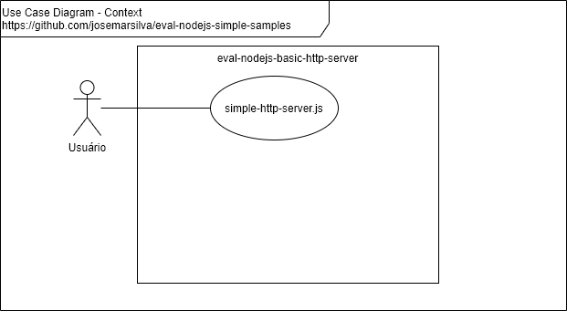
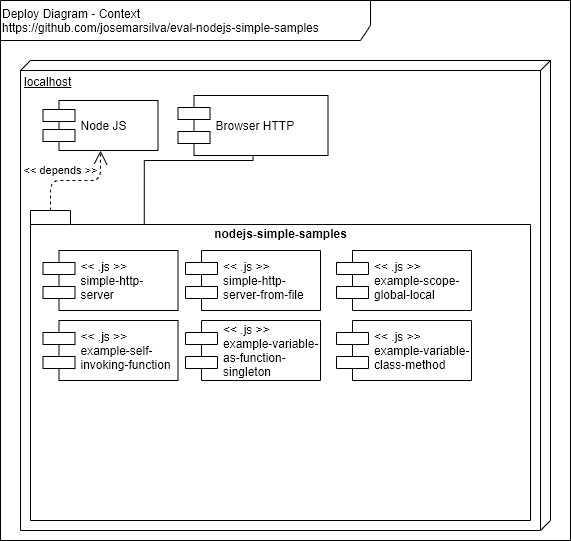

# eval-nodejs-simple-samples

## 1. Introdução

Este repositório contém os artefatos do projeto **eval-nodejs-simple-samples**, um servidor para responder a chamadas HTTP.


### 2. Documentação

### 2.1. Diagrama de Caso de Uso



### 2.2. Diagrama de Implantação




### 2.3. Diagrama Modelo de Dados

* n/a


## 3. Projeto

### 3.1. Pré-requisitos

* Node.js v10.14.1 (recomendada)
* NPM 6.9.0 (recomendada)

```cmd
C:\...\eval-nodejs-simple-samples> node -v
v10.16.0
```

```cmd
C:\...\eval-nodejs-simple-samples> npm -v
6.9.0
```

### 3.2. Guia para Desenvolvimento

* Clone o projeto usando `git clone`. Use a _branch_ `master` se a _branch_ `develop` não estiver disponível
* Faça suas alterações na _branch_ `develop` quando disponível. Peça permissão de escrita caso falte.

### 3.2.1. Criando a aplicação NodeJS do servidor HTTP Simples

* edit `simple-http-server.js`

```cmd
var http = require('http');

http.createServer(function(req,res){
    res.end('Hello Simple HTTP Server');
}).listen(3000);
``` 

### 3.2.2. Criando a aplicação NodeJS do servidor HTTP Simples a partir de uma arquivo

* Edit `simple-http-server-from-file.js`

```cmd
var http = require('http');
var fs = require('fs')
var contents = fs.readFileSync('simple-http-server-from-file.html');

http.createServer(function(req,res){
    res.end(contents);
}).listen(3000);
``` 

* Edit `simple-http-server-from-file.html`

```html
<html>
    <body>
        <h1>Hello simple-http-server-from-file</h1>
        Wellcome! Your HTTP server captured your request, read content of file and output as result!
    </body>
</html>

```

### 3.2.3. Entendendo escopo global de variáveis

* Edit `example-scope-global-local.js`

```cmd
var a = 10; // declare a global scope
function inc() {
    a+=1;   // increment. Este escopo acessa variável do escopo "de fora"
    b = 11; // declare b. Quando se omite "var" o escopo não é travado,
            // implicitamente vira "escopo global"
    var c = 3; // declare c escopo "local". Existe somente enquanto
               // function inc() existir
}
inc();
console.log(a, b);
// console.log(c); // ReferenceError: c is not defined
``` 

### 3.2.4. Entendendo Self Invoking Function

* Vantagem de não sujar o escopo global
* Edit `example-self-invoking-function.js`

```cmd
(function(){
    console.log('Example of Self invoking function');
})();
``` 

### 3.2.5. Entendendo Variável como Função e Exemplo de Singleton

* Edit ``example-variable-as-function-singleton.js``

```cmd
var conta = (function(){
    var contador = 0;
    return function(){ contador++; console.log(contador)}
})();

conta();
conta();
conta();
``` 

### 3.3. Guia para Configuração ###

* n/a

### 3.4. Guia para Implantação ###

* n/a


### 3.5. Guia para Teste ###

### 3.5.1. Teste 1: Simple HTTP Server

a. Inicia o Simple HTTP Server

```cmd
C:\...\eval-nodejs-simple-samples>node simple-http-server.js
```

b. Abrir a página do servidor/porta pelo browser

```cmd
+----------------------------+
| http://localhost:3000      |
+----------------------------+
| Hello Simple HTTP Server   |
+----------------------------+
```

### 3.5.2. Teste 2: Simple HTTP Server reading contents from file

a. Inicia o Simple HTTP Server from File

```cmd
C:\...\eval-nodejs-simple-samples>node simple-http-server-from-file.js
```

b. Abrir a página do servidor/porta pelo browser

```cmd
+---------------------------------------------------------------------------------------------------+
| http://localhost:3000                                                                            |
+---------------------------------------------------------------------------------------------------+
| Hello simple-http-server-from-file                                                               |
|  Wellcome! Your HTTP server captured your request, read content of file and output as result! |
+---------------------------------------------------------------------------------------------------+
```

### 3.5.3. Teste 3: Exemplo de escopo - Global Scope, Var, Var ommited, etc

```cmd
C:\...\eval-nodejs-simple-samples>node example-scope-global-local.js
```

* Observe que variável `b` foi criada no escopo global

```console
11 11
```

* Se remover o comentário `//` da linha `console.log(c);` haverá um erro de  de execução `ReferenceError: c is not defined`  porque a variável não existe mais. 


### 3.5.4. Teste 4: Exemplo de Self Invoking Function

```cmd
C:\...\eval-nodejs-simple-samples>node example-self-invoking-function.js
```

### 3.5.5. Teste 5: Exemplo de variável como Função e Exemplo de Singleton

```cmd
C:\...\eval-nodejs-simple-samples>node example-variable-as-function-singleton.js
```

* Observe que o valor da variável `contador` no escopo da função dentro da variável `conta` foi preservado. A referência a `contador` busca no escopo pai a mesma variável, por isto é possível incrementá-la.

```console
1
2
3
```


### 3.6. Guia para Execução ###

* n/a


### 3.7. Guia de Credenciais de Acesso ###

* n/a


## Referências ##

* [NodeJS Primeiros Passos: Servidor HTTP Básico](https://www.youtube.com/watch?v=5L5-EoJbMfY)
* [NodeJS Primeiros Passos: Closures e Escopos](https://www.youtube.com/watch?v=Xexyc2J-Di0)
* [Node.js - Documentation - HTTP module](https://nodejs.org/api/http.html)
