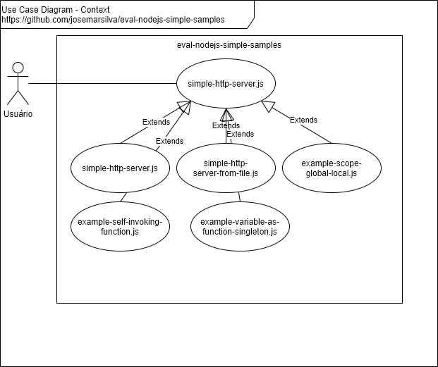
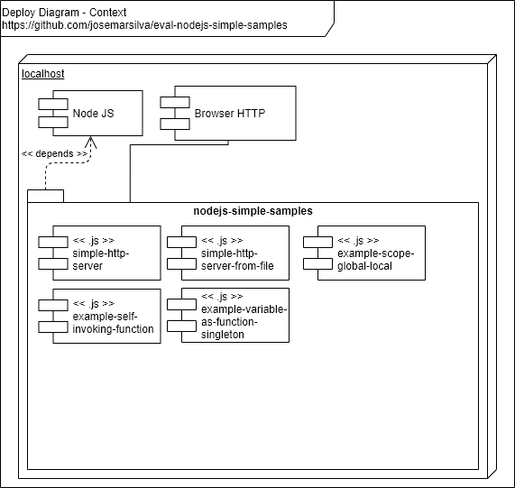

# eval-nodejs-simple-samples

## 1. Introdução

Este repositório contém os artefatos do projeto **eval-nodejs-simple-samples**, um servidor para responder a chamadas HTTP.


### 2. Documentação

### 2.1. Diagrama de Caso de Uso



### 2.2. Diagrama de Implantação




### 2.3. Diagrama Modelo de Dados

* n/a


## 3. Projeto

### 3.1. Pré-requisitos

* Node.js v10.14.1 (recomendada)
* NPM 6.9.0 (recomendada)

```cmd
C:\...\eval-nodejs-simple-samples> node -v
v10.16.0
```

```cmd
C:\...\eval-nodejs-simple-samples> npm -v
6.9.0
```

### 3.2. Guia para Desenvolvimento

* Clone o projeto usando `git clone`. Use a _branch_ `master` se a _branch_ `develop` não estiver disponível
* Faça suas alterações na _branch_ `develop` quando disponível. Peça permissão de escrita caso falte.

### 3.2.1. Criando a aplicação NodeJS do servidor HTTP Simples

* edit `simple-http-server.js`

```cmd
var http = require('http');

http.createServer(function(req,res){
    res.end('Hello Simple HTTP Server');
}).listen(3000);
``` 

### 3.2.2. Criando a aplicação NodeJS do servidor HTTP Simples a partir de uma arquivo

* Edit `simple-http-server-from-file.js`

```cmd
var http = require('http');
var fs = require('fs')
var contents = fs.readFileSync('simple-http-server-from-file.html');

http.createServer(function(req,res){
    res.end(contents);
}).listen(3000);
``` 

* Edit `simple-http-server-from-file.html`

```html
<html>
    <body>
        <h1>Hello simple-http-server-from-file</h1>
        Wellcome! Your HTTP server captured your request, read content of file and output as result!
    </body>
</html>

```

### 3.3. Guia para Configuração ###

### 3.3.1. Instalação de pacotes e dependências ###

a. Instalação do json-server

```cmd
C:\...\eval-nodejs-simple-samples> npm install -g json-server
```


### 3.4. Guia para Implantação ###

* n/a


### 3.5. Guia para Teste ###

### 3.5.1. Teste 1: Simple HTTP Server

a. Inicia o Simple HTTP Server

```cmd
C:\...\eval-nodejs-simple-samples>node simple-http-server.js
```

b. Abrir a página do servidor/porta pelo browser

```cmd
+----------------------------+
| http://localhost:3000      |
+----------------------------+
| Hello Simple HTTP Server   |
+----------------------------+
```

### 3.5.2. Teste 2: Simple HTTP Server reading contents from file

a. Inicia o Simple HTTP Server from File

```cmd
C:\...\eval-nodejs-simple-samples>node simple-http-server-from-file.js
```

b. Abrir a página do servidor/porta pelo browser

```cmd
+---------------------------------------------------------------------------------------------------+
| http://localhost:3000                                                                            |
+---------------------------------------------------------------------------------------------------+
| Hello simple-http-server-from-file                                                               |
|  Wellcome! Your HTTP server captured your request, read content of file and output as result! |
+---------------------------------------------------------------------------------------------------+
```

### 3.6. Guia para Execução ###

* n/a


### 3.7. Guia de Credenciais de Acesso ###

* n/a


## Referências ##

* [NodeJS Primeiros Passos: Servidor HTTP Básico](https://www.youtube.com/watch?v=5L5-EoJbMfY)
* [NodeJS Primeiros Passos: Closures e Escopos](https://www.youtube.com/watch?v=Xexyc2J-Di0)
* [Node.js - Documentation - HTTP module](https://nodejs.org/api/http.html)
